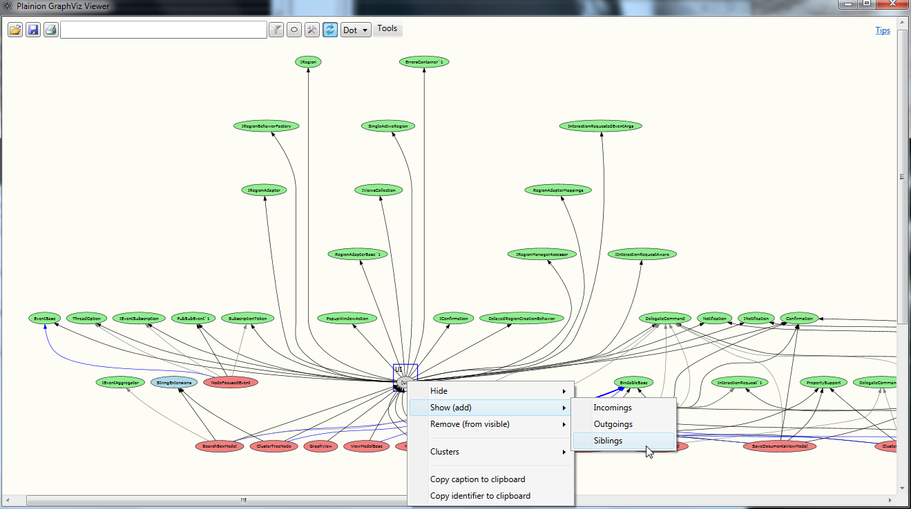
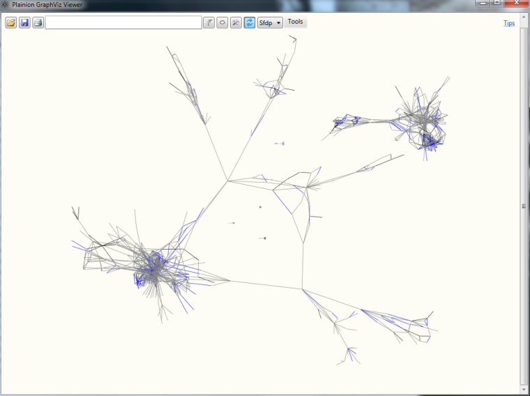
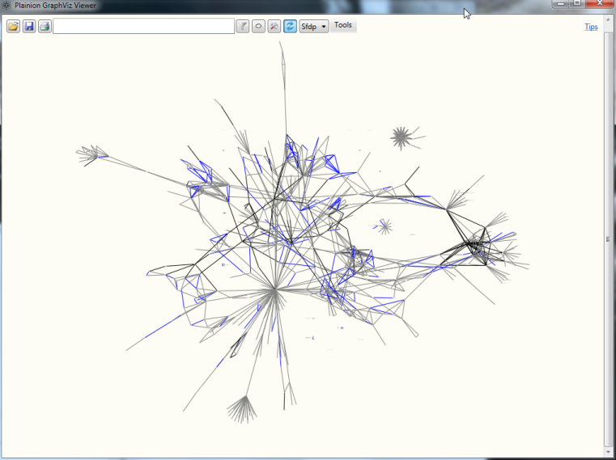

Plainion.GraphViz is a browser for complex and huge graphs. 

It makes it easy to dive into any kind of graph from all different kind of sources by interactively 
allowing to show, hide and fold any part of the graph.

## Installation

- download [latest release](https://github.com/plainionist/Plainion.GraphViz/releases) and unpack it anywhere
- download [GraphViz rendering tools](http://www.graphviz.org/) and unpack anywhere
- on first startup of Plainion.GraphViz.Viewer the settings dialog will open, asking for the 
  home of the "GraphViz rendering tools" from previous step

## Usage

Once a graph was imported (see below)

- use search edit box to fast navigate to nodes 
- use mouse wheel and right mouse button drag for zoom 
- use left mouse button for pan 
- use context menu on nodes, edges and clusters to morph the graph into any shape 
- use  to filter the graph based on regex
- use  to define clusters with Drag&Drop

### Importing graphs from documents

Use the "Open" button from the toolbar to load graphs from documents. 
The following formats are supported:

- GraphML
- DGML
- DOT

Try out the [samples](doc/Viewer.Samples/).

If the document gets modified while loaded into Plainion.GraphViz the graph will automatically updated.

### Importing graphs from source code

Use the "Tools" button from the toolbar to load graphs from other "sources".
The following tools are supported:

- Generate graphs from inheritance hierarchies (.Net only)
- Generate graphs from software packages or sub-systems (.Net only)
  (see [Packaging Sample](doc/Viewer.Samples/Packaging.xaml))

Which kind of galaxy does your code form?

# Extensibility

Plainion.GraphViz supports writing custom plugins to create graphs from custom sources.

Just download the source and have a look at Plainion.GraphViz.Modules.Documents and Plainion.GraphViz.Modules.CodeInspection
to see how to integrate plugins into Plainion.GraphViz. Inside the custom plugin just

- parse the custom source (code, database, ...)
- generate a graph
- add optional meta information (e.g. edge colors, tooltips)
- pass it to the viewer
