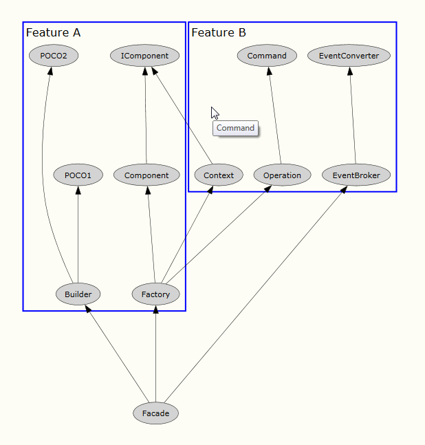
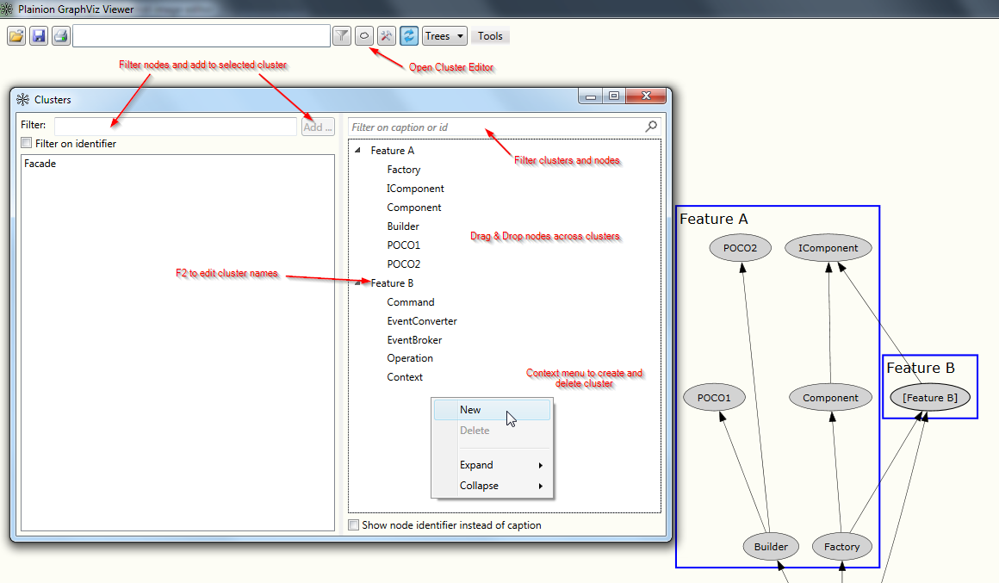

# Clusters 

A cluster is a group of nodes forming a sub-graph. 

 

Clusters are visualized with a blue rectangle.
Clusters can be folded and unfolded using the context menu on the cluster.

 

Folded clusters will contain a single "dummy" node which allows you to continue working with the folded cluster as
with any other node, e.g.: apply filtering.

## Cluster Editor

You can use the Cluster Editor to manage clusters.

 

## Manage clusters within the graph

You can use the context menu on a node to add (selected) nodes(s) to a cluster from within the graph.

 

## Clusters in DOT language

In order to create clusters in a DOT file add the respective nodes to a "subgraph" and prefix the subgraph with "cluster_".

```
digraph {
  subgraph "cluster_C1" {
    label = "Feature A"

    Builder
    Component
    Factory
    IComponent 
    POCO1
    POCO2
  }

  ...
}
```

See [Creating graphs with DOT language](/HowTos/Create graphs with DOT language) for a basic introduction to the DOT language

# Hands-on

<iframe width="560" height="315" src="https://www.youtube.com/embed/z5By78jlR3M" title="YouTube video player" 
    frameborder="0" allow="accelerometer; autoplay; clipboard-write; encrypted-media; gyroscope; picture-in-picture; web-share" 
    llowfullscreen>
</iframe>
