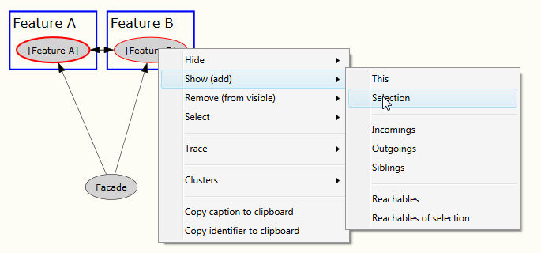
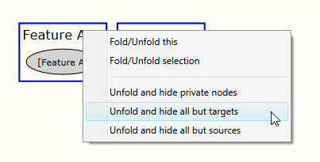
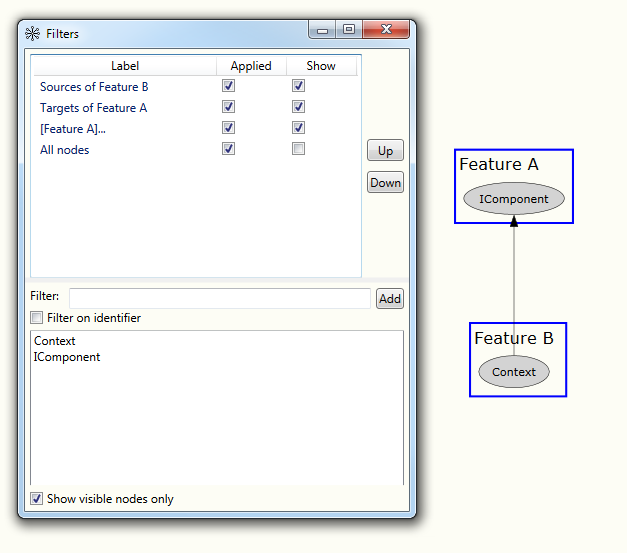

# Clusters 

A cluster is a group of nodes forming a sub-graph. 

 

Clusters are visualized with a blue rectangle.
Clusters can be folded and unfolded using the context menu on the cluster.

 

Folded clusters will contain a single "dummy" node which allows you to continue working with the folded cluster as
with any other node, e.g.: apply filtering.

## Cluster Editor

You can use the Cluster Editor to manage clusters.

 

## Manage clusters within the graph

You can use the context menu on a node to add (selected) nodes(s) to a cluster from within the graph.

 

## Clusters in DOT language

In order to create clusters in a DOT file add the respective nodes to a "subgraph" and prefix the subgraph with "cluster_".

```
digraph {
  subgraph "cluster_C1" {
    label = "Feature A"

    Builder
    Component
    Factory
    IComponent 
    POCO1
    POCO2
  }

  ...
}
```

See [Creating graphs with DOT language](/HowTos/Create graphs with DOT language) for a basic introduction to the DOT language

## Analysing Cluster dependencies

You can analyze which nodes are causing dependencies (edges) between clusters by first creating a show filter for the 
clusters of interest (this is important as the following steps depend on having a show filter as basis).

 

Now unfold the cluster containing the targeted nodes with "Unfold and hide all but targets"

 

Then unfold the cluster containing the "source nodes" with "Unfold and hide all but sources"

 

This will uncover the dependency creating nodes. 

*Note:* In order to generate this view two filters have been applied behind the scenes which you would have 
to disable/delete in order to get back to the start layout. If you just delete the first two filters you will 
see nothing on the canvas. This is because the "show both clusters" filter is still active with says "only show 
the folded clusters". As both clusters are unfolded nothing can be shown.

