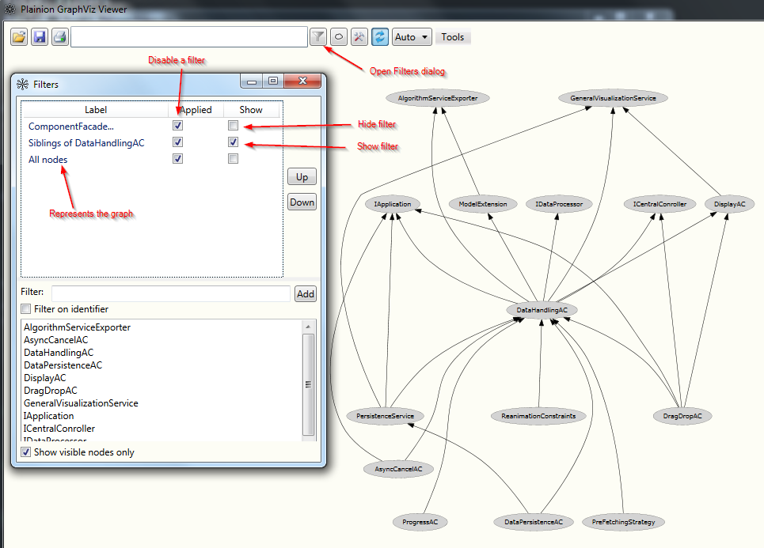
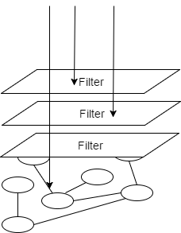
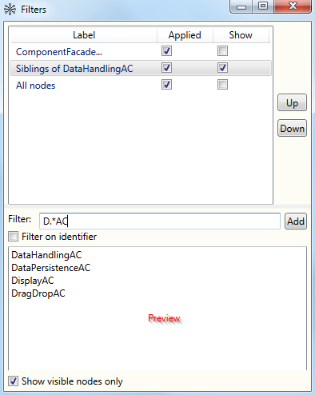
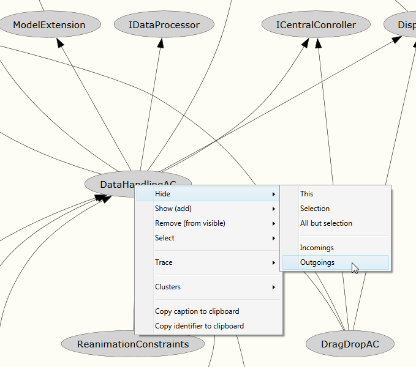
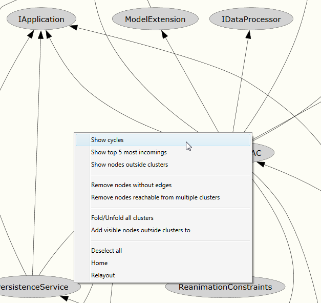

# Filters

Applying filters to the graph is a very powerful feature of Plainion.GraphViz. It is that feature which 
finally enables you to explore even the most complex graph to uncover the graph's secrets.

Plainion.GraphViz has two basic filter types:

- "Show" filter: specifies which nodes should be seen
- "Hide" filter: specifies which nodes should be hidden

Most filters created with the UI are "delta" filters which specify the nodes to be added to/removed from the 
visible graph.

You can create as many filters as you like. Filters will be managed on a stack where the graph is at the bottom 
and the filter will be "pushed" on top in the order you create those. You can switch each "show" filter to a "hide"
filter and vice versa. You can temporarily disable filters or delete them.

 

You can use the "Up"/"Down" buttons or the Ctrl-Up/Ctrl-Down keys in the Filters dialog to move the selected filter 
up/down. You can use the DEL key or the context menu to delete filters.

## Combining filters

When multiple filters are applied, Plainion.GraphViz uses similar technique as "ray casting" to determine which 
nodes should be shown and which not. 

 

It starts at the top of the stack and checks for each node whether it is "covered" by a filter:

- if YES and filter is a HIDE filter the node will be HIDDEN
- if YES and filter is a SHOW filter the node will be SHOWN
- if NO the next filter in the stack will be checked
- if a node is not considered by any filter at all this node is to be considered as visible

This mechanism is very powerful but also requires a little learning curve. So when ever you wonder why certain 
filter does not have the effect you expected try to apply the technique of "ray casting" mentally on the existing
stack of filters.

## Create filters from patterns

The easiest way to create a filter is using the "Filter" text box in the Filters dialog. It allows you to specify
matching nodes via regular expressions on the node caption or the node identifier.

 

In the preview pane you will see on which of the visible nodes the pattern will match.

## Create filters from nodes

You can create filters starting from a single or set of selected nodes by using the context menu on a node.

 

The context menu contains various options to create "add"/"remove" filters from this and related nodes
which should be self-explanatory.

*Hint:* The "Trace" context menu requires at least one "target node" to be selected you can then choose from.

## Create filters from algorithms

The context menu available from the canvas provides some additional algorithms to compute filters.

 

These algorithms are node independent and are applied to the entire graph.

## Tips

After having done some filtering you can use the context menu on the canvas and the "Relayout" menu entry to
re-layout the graph. This usually shows the remaining nodes in a more compact form.

# Hands-on

<iframe width="560" height="315" src="https://www.youtube.com/embed/z5By78jlR3M" title="YouTube video player" 
    frameborder="0" allow="accelerometer; autoplay; clipboard-write; encrypted-media; gyroscope; picture-in-picture; web-share" 
    llowfullscreen>
</iframe>
