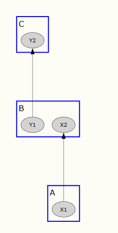
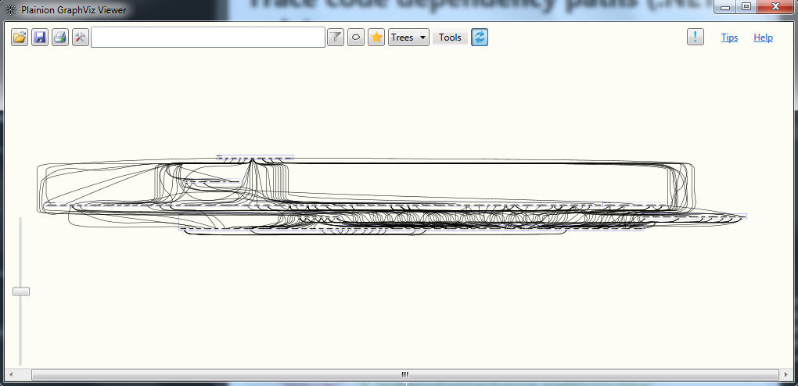
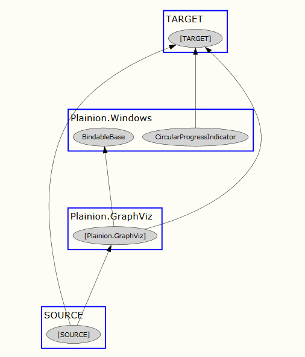

# Explore indirect assembly dependencies (.NET only)

When exploring assembly dependencies there are basically two types of dependencies

*Direct dependencies*: A type in assembly A uses a type in assembly B and so assembly A depends on assembly B.
 
*Indirect dependencies*: A type in assembly A uses a type in assembly B and a different type in assembly B uses a 
type in assembly C. By that assembly A indirectly depends on assembly C. The following sample illustrates this type 
of dependency:



Exploring and visualizing both types of dependencies is not an easy task, especially not for a bigger code base. 
The PathFinder tool supports you here by tracing all direct and indirect paths from a set of "source" assemblies
to a set of "target" assemblies.


To start the tracing load a configuration file of the following schema:

```json
{
    "netFramework" : "false",
    "binFolder": "D:/Workspace/Plainion/Plainion.GraphViz/bin/Debug",
    "keepInnerAssemblyDependencies": false,
    "keepSourceAssemblyClusters": false,
    "keepTargetAssemblyClusters": false,
    "sources": [ "Plainion.GraphViz.Modules.CodeInspection.*.dll" ],
    "targets": [ "Plainion.Core.dll" ],
    "relevantAssemblies": [ "Plainion.*" ]
}
```

- "netFramework" specifies the DotNet runtime which should be used. By default .NET is used. Set it to "true" to use .NET Framework
- "binFolder" specifies the folder where all assemblies are located
- "keepInnerAssemblyDependencies" specifies whether dependencies within assemblies should be part of the graph.
- "keepSourceAssemblyClusters" specifies whether the source assemblies should be kept as clusters. If set to
  false a single cluster "SOURCE" will be created for all source assembly types.
- "keepTargetAssemblyClusters" specifies whether the target assemblies should be kept as clusters. If set to
  false a single cluster "TARGET" will be created for all target assembly types.
- "sources" specifies the source assemblies. Wildcards supported.
- "targets" specifies the target assemblies. Wildcards supported.
- "relevantAssemblies" can be used to limit the assemblies to be analyzed.

When clicking "Create graph" you will get a graph showing all possible paths from the source assemblies to the
target assemblies.



You can then navigate and explore the graph as usual to extract concrete dependency paths like this:




# Hands-on

<iframe width="560" height="315" src="https://www.youtube.com/embed/jMi1I6Pd_9M" title="YouTube video player" frameborder="0" allow="accelerometer; autoplay; clipboard-write; encrypted-media; gyroscope; picture-in-picture; web-share" allowfullscreen></iframe>
