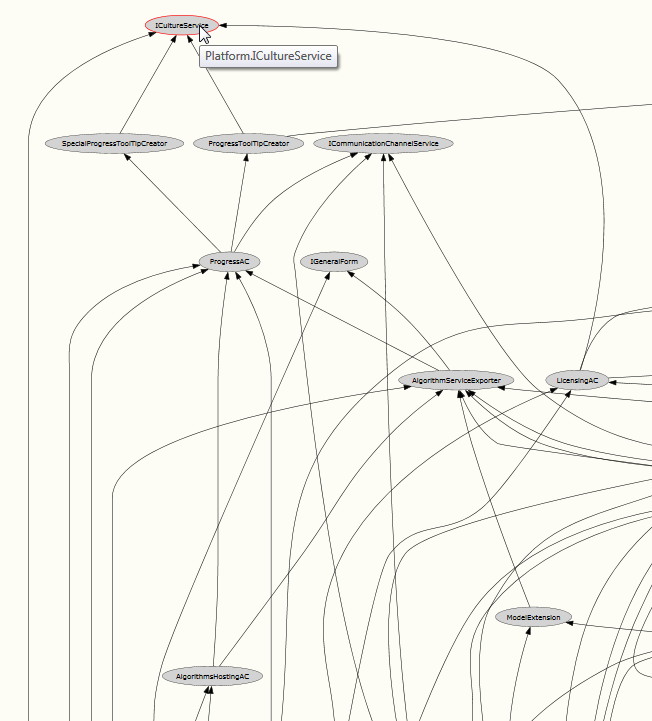
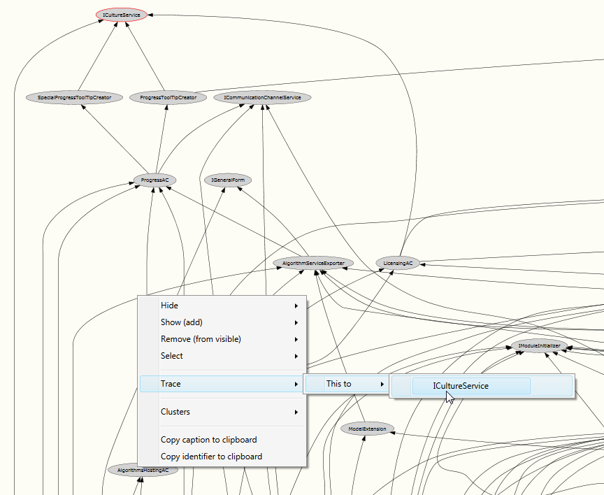
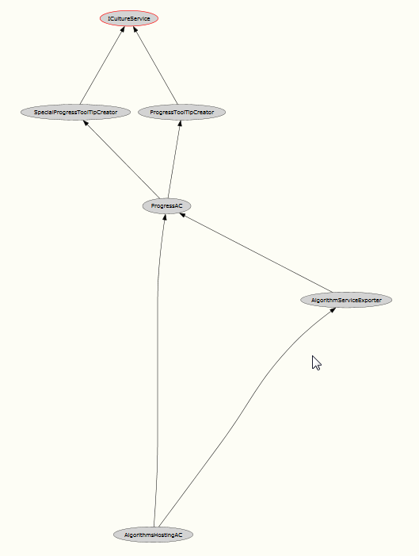

# Trace paths between nodes

You can visualize all paths between nodes by first selecting the target node with Ctrl-LMB click

Then use the context menu entry "Trace" on the source node to start the tracing.

As a trace result a filter will be created which only shows all paths from this source node to 
the selected target node.

