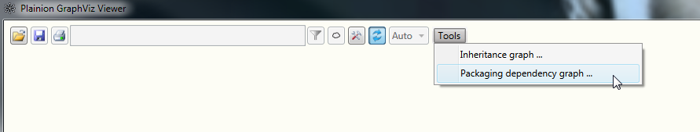
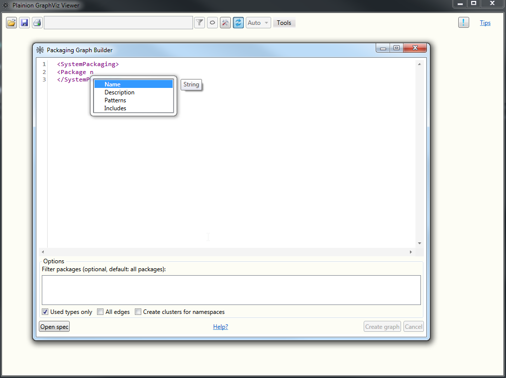
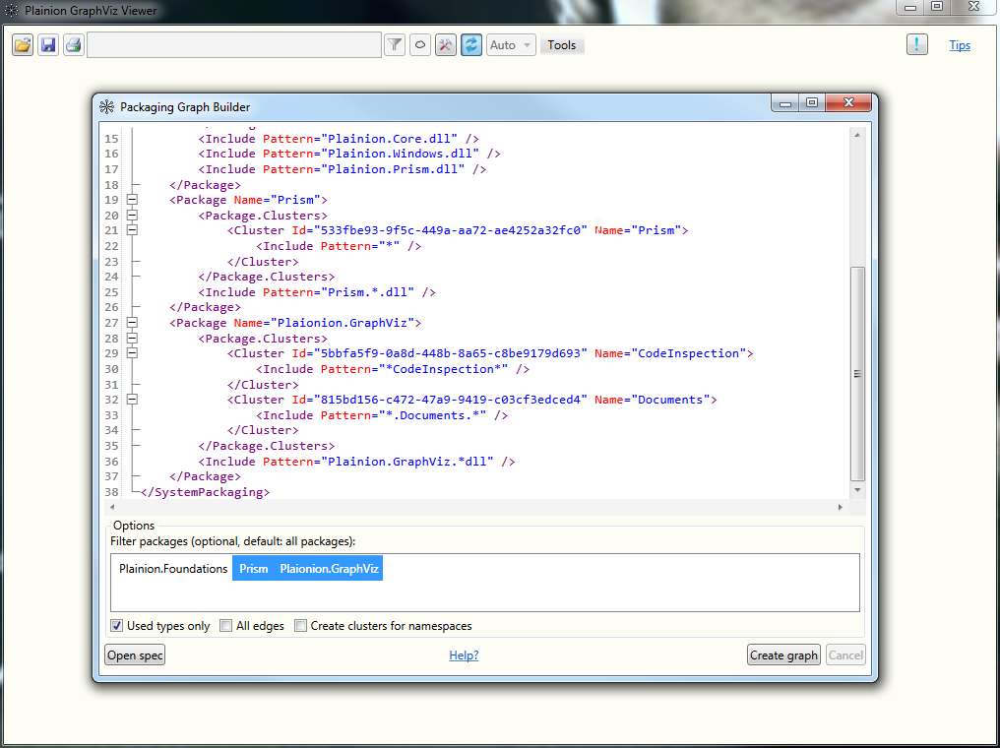

# Visualize code dependencies (.NET only)

You can generate a graph showing your code dependencies using the "Package dependencies" tool.



Use the "Package Spec Editor" to specify which assemblies to analyze and which high level structure
your system has.

 

An initial package spec can look like this:

```xml
<?xml version="1.0" encoding="utf-16"?>
<SystemPackaging AssemblyRoot="." NetFramework="false" xmlns="http://github.com/ronin4net/plainion/GraphViz/Packaging/Spec">
    <Package Name="Plainion.Foundations">
        <Package.Clusters>
            <Cluster Name="UI">
                <Include Pattern="Plainion.Windows.*" />
                <Include Pattern="Plainion.Prism.*" />
            </Cluster>
            <Cluster Name="Core">
                <Include Pattern="*" />
                <Exclude Pattern="Plainion.Windows.*" />
                <Exclude Pattern="Plainion.Prism.*" />
            </Cluster>
        </Package.Clusters>
        <Include Pattern="Plainion.Core.dll" />
        <Include Pattern="Plainion.Windows.dll" />
        <Include Pattern="Plainion.Prism.dll" />
    </Package>
    <Package Name="Prism">
        <Package.Clusters>
            <Cluster Name="Prism">
                <Include Pattern="*" />
            </Cluster>
        </Package.Clusters>
        <Include Pattern="Prism.*.dll" />
    </Package>
    <Package Name="Plaionion.GraphViz">
        <Package.Clusters>
            <Cluster Name="CodeInspection">
                <Include Pattern="*CodeInspection*" />
            </Cluster>
            <Cluster Name="Documents">
                <Include Pattern="*.Documents.*" />
            </Cluster>
        </Package.Clusters>
        <Include Pattern="Plainion.GraphViz.*dll" />
    </Package>
</SystemPackaging>
```

A package is specified by a set of assemblies which can be defined using "include" and "exclude" directives.
A package can have one or more clusters which would then be mapped to [Clusters](../Clusters) in the graph.
The "include" and "exclude" directives within a cluster map to namespaces.

You can then either analyze the dependencies between packages by selecting the packages of interest or within one package 
by just selecting a particular one.

Use "NetFramework" property to define whether .Net framework runtime should be used instead of .NET runtime.



If you don't have specified any clusters within your packages you can select "Create clusters for namespaces" to generate
clusters automatically, one for each namespace.

When clicking "Create graph" you will get graphs similar to the ones below - depending on the dependency structure in your
code base of course.


## Conventions

Graphs generated from code dependencies will follow the following conventions:

- Blue edges: inheritance or interface implementation
- Black edges: method calls
- Gray edges: everything else (e.g. usage of cast operators)

# Hands-on

<iframe width="560" height="315" src="https://www.youtube.com/embed/m6B9-mGJ0LY" title="YouTube video player" frameborder="0" allow="accelerometer; autoplay; clipboard-write; encrypted-media; gyroscope; picture-in-picture; web-share" allowfullscreen></iframe>
